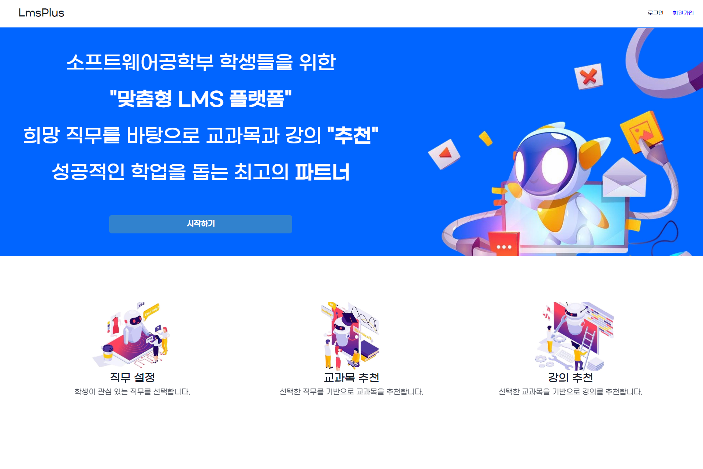
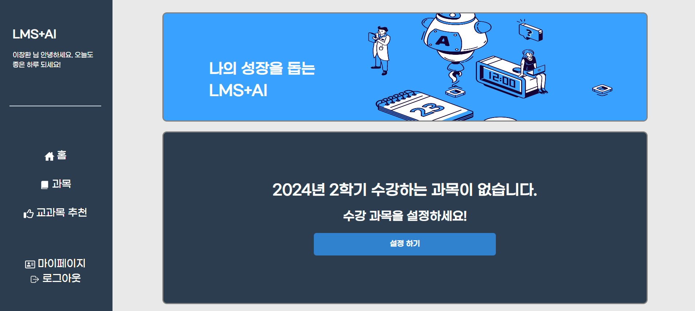
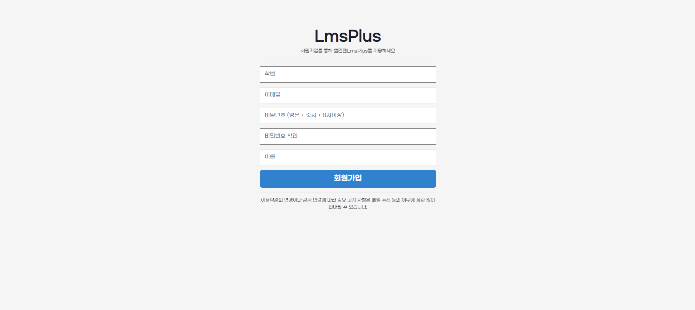
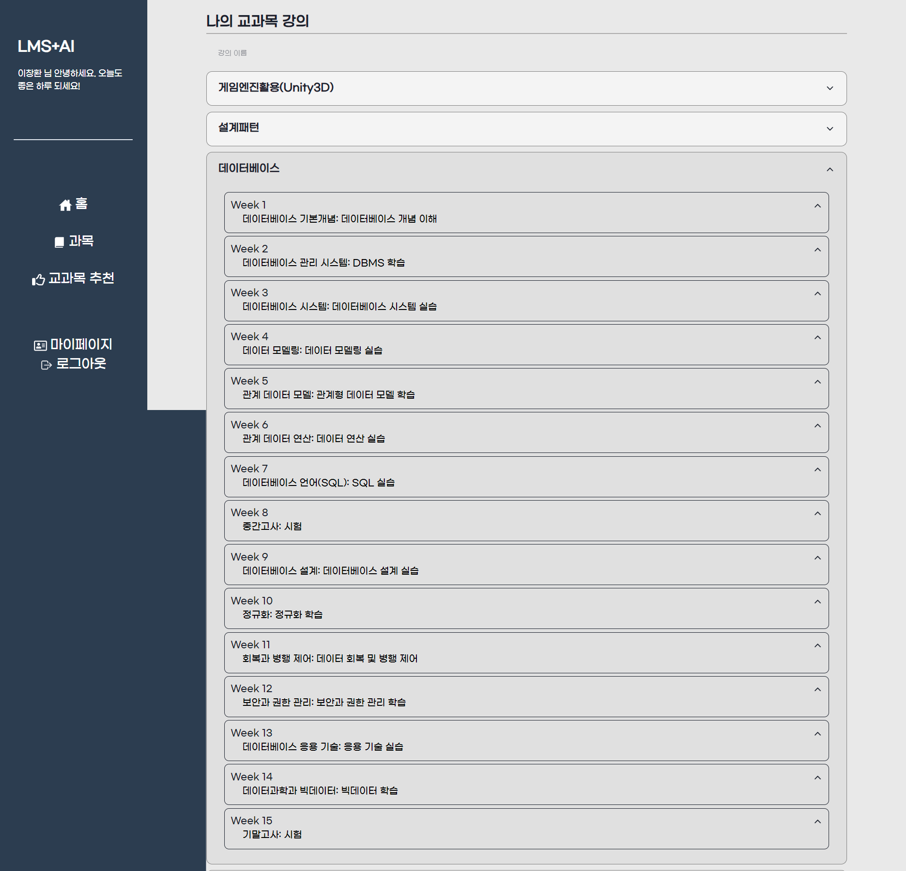
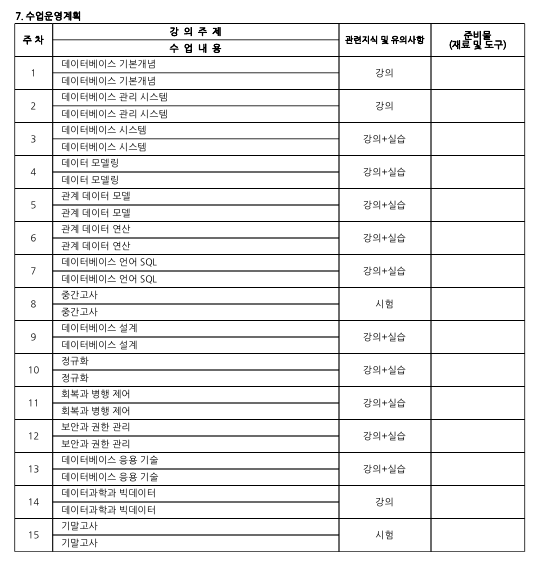
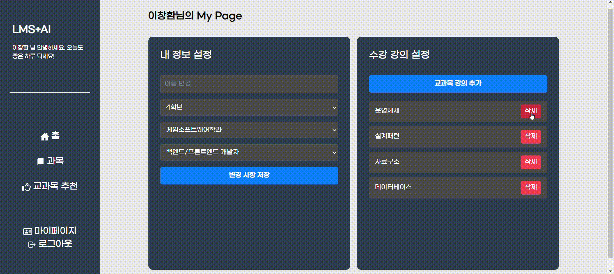
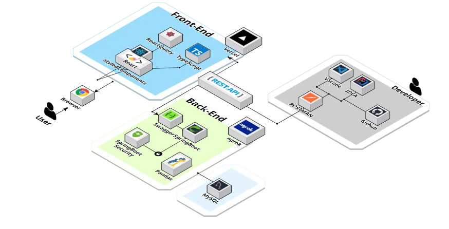
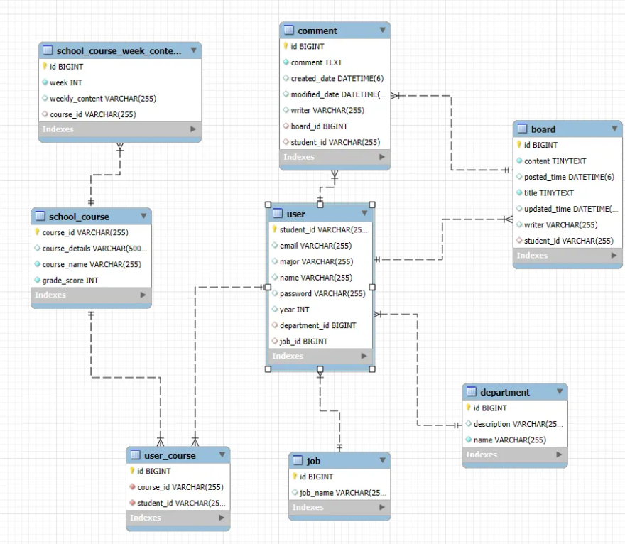

# RedPenLMS
 

**LMS💻 + AI🤖, learning assistant platform** 

---
 

### **_플랫폼 기능_**

- 소프트웨어학부 전용 LMS  + AI **설계**
  - 학생의 희망 진로/직무 **선택**
  - 직무 별 교과목 강의 **추천**
  - 교과목 관련 인프런 강의 **추천**
- 주차별 학습 계획 및 성과 **확인**
--- 
### **추가 예정 기능**
- 교과목에 대한 강의평(후기) **제공**
- 전공도서 **중고거래**

---
### 웹 시현

  
접속, 메인화면

  
회원가입 후 직무 설정에 따른 교과목 추천

  
추천 학과 설문

  
교과목 선택

  
교과목 계획표(비교)

  
교과목에 따른 인프런 강의 추천

  
마이페이지

---
 

### Architecture

---
 

### ERD Diagram

---
⛓️‍💥[LMS-Plus-AI](http://lmsplusai.kro.kr/)